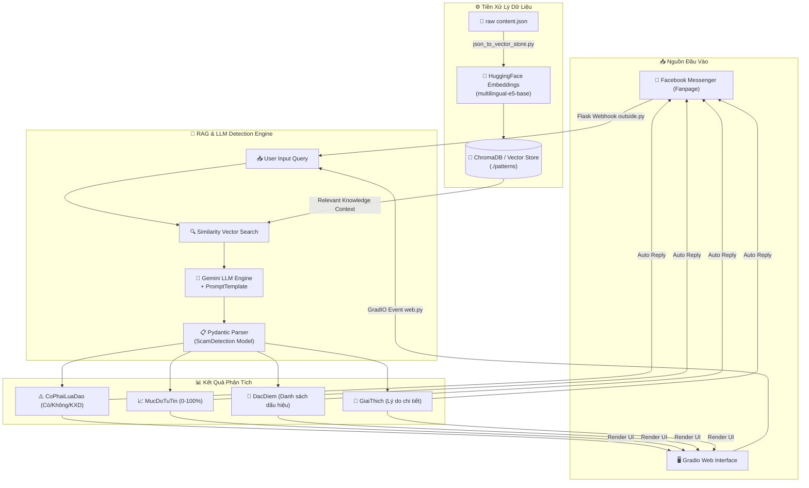

<div align="center">

# 🛡️ SOCIETY FRAUDENT 🛡️
### 🤖 AI-Powered Anti-Scam & Phishing Detection System
*Hệ thống Trí Tuệ Nhân Tạo (RAG + Gemini AI) Phát Hiện & Cảnh Báo Lừa Đảo Mạng Xã Hội*

[](https://python.org)
[](https://www.llamaindex.ai/)
[](https://ai.google.dev/)
[](https://gradio.app/)
[](https://flask.palletsprojects.com/)
[](https://www.trychroma.com/)

---

</div>

> [!IMPORTANT]
> **Society Fraudent** là giải pháp công nghệ tiên phong kết hợp **Retrieval-Augmented Generation (RAG)** và mô hình ngôn ngữ lớn **Google Gemini AI** nhằm phát hiện, phân tích và đưa ra cảnh báo sớm về các hành vi lừa đảo, giả mạo tài khoản và tin nhắn bẫy trên mạng xã hội tại Việt Nam.

---

## 📑 Mục Lục (Table of Contents)
- [✨ Tính Năng Nổi Bật](#-tính-năng-nổi-bật)
- [🏗️ Kiến Trúc Hệ Thống](#️-kiến-trúc-hệ-thống)
- [📂 Cấu Trúc Dự Án](#-cấu-trúc-dự-án)
- [⚙️ Công Nghệ Sử Dụng](#️-công-nghệ-sử-dụng)
- [🚀 Hướng Dẫn Cài Đặt & Chạy Dự Án](#-hướng-dẫn-cài-đặt--chạy-dự-án)
  - [1. Yêu cầu hệ thống](#1-yêu-cầu-hệ-thống)
  - [2. Cài đặt môi trường](#2-cài-đặt-môi-trường)
  - [3. Chuẩn hóa & Tạo Vector Store](#3-chuẩn-hóa--tạo-vector-store)
  - [4. Khởi chạy Giao diện Web (Gradio)](#4-khởi-chạy-giao-diện-web-gradio)
  - [5. Tích hợp Facebook Messenger Webhook](#5-tích-hợp-facebook-messenger-webhook)
- [🧪 Cấu Trúc Kết Quả Đầu Ra (JSON Output Schema)](#-cấu-trúc-kết-quả-đầu-ra-json-output-schema)
- [🔮 Lộ Trình Phát Triển (Roadmap)](#-lộ-trình-phát-triển-roadmap)
- [📜 Giấy Phép (License)](#-giấy-phép-license)

---

## ✨ Tính Năng Nổi Bật

| Biểu Tượng | Tính Năng | Mô Tả Chi Tiết |
| :---: | :--- | :--- |
| 🧠 | **RAG Scam Intelligence** | Truy vấn tri thức lừa đảo thực tế từ Vector DB (`e5-multilingual`/`bge-m3`) kết hợp ngữ cảnh tiếng Việt để nhận diện thủ đoạn mới nhất. |
| 📊 | **Scam Score Dynamic Slider** | Đánh giá mức độ tin cậy rủi ro (0 – 100%) trực quan với thanh slider chuyển màu linh hoạt (Xanh 🟢 ➔ Vàng 🟡 ➔ Đỏ 🔴). |
| 🎯 | **Trích Xuất Dấu Hiệu Tự Động** | Tự động lọc ra danh sách các đặc điểm nghi vấn cụ thể (VD: link rút gọn, đóng phí trước, hứa hẹn lãi suất cao...). |
| 💬 | **Facebook Fanpage Webhook** | Kết nối trực tiếp Facebook Graph API v18.0 để tự động phân tích & phản hồi tin nhắn từ người dùng Fanpage. |
| 🖥️ | **Giao Diện Gradio Web App** | Giao diện chuẩn **Ocean Theme** tinh tế, dễ sử dụng cho người dùng kiểm tra nhanh các đoạn tin nhắn nghi vấn. |
| 🗃️ | **Chuyển Đổi Dữ Liệu Linh Hoạt** | Công cụ tiền xử lý tự động nén cơ sở dữ liệu dạng JSON (`content.json`) thành Vector Embeddings lưu tại ChromaDB/Storage. |

---

## 🏗️ Kiến Trúc Hệ Thống



---

## 📂 Cấu Trúc Dự Án

```bash
society-fraudent/
├── 📄 chatbot_configure.py    # Cấu hình RAG Engine, Gemini API, Prompt Template & Pydantic Parser
├── 📄 web.py                  # Giao diện Gradio Web Application với CSS Custom Dynamic Slider
├── 📄 outside.py              # Flask Webhook Server xử lý xác minh & nhận sự kiện tin nhắn Facebook
├── 📄 send.py                 # Service gửi phản hồi lại cho người dùng qua Facebook Graph API v18.0
├── 📂 preprocess/
│   ├── 📄 content.json        # Cơ sở dữ liệu mẫu về các thủ đoạn & mẫu tin nhắn lừa đảo tại Việt Nam
│   └── 📄 json_to_vector_store.py # Script nạp JSON và tạo Vector Embeddings lưu trữ vào ChromaDB
├── 📂 patterns/               # Thư mục lưu trữ Vector Store & Index đã được persist
├── 📄 requirements.txt        # Danh sách các thư viện phụ thuộc (LlamaIndex, Gradio, Flask, ChromaDB...)
└── 📄 README.md               # Tài liệu hướng dẫn dự án
```

---

## ⚙️ Công Nghệ Sử Dụng

- **LLM Core**: Google Gemini Flash API (`llama-index-llms-gemini`)
- **RAG & Framework**: [LlamaIndex](https://www.llamaindex.ai/) (v0.14+)
- **Embedding Model**: `intfloat/multilingual-e5-base` / `BAAI/bge-m3` via HuggingFace
- **Vector Database**: [ChromaDB](https://www.trychroma.com/) / Local Storage Context
- **Frontend UI**: [Gradio](https://gradio.app/) (Ocean Theme + Custom Dynamic CSS)
- **Backend & Webhook**: Flask, Requests, Ngrok Public Tunnel
- **Integration**: Facebook Graph API v18.0

---

## 🚀 Hướng Dẫn Cài Đặt & Chạy Dự Án

### 1. Yêu cầu hệ thống
- Python `>= 3.10`
- API Key của **Google Gemini API** ([Lấy key tại Google AI Studio](https://aistudio.google.com/))
- (Tùy chọn) Facebook Developer Account & Ngrok nếu kết nối Fanpage Messenger.

### 2. Cài đặt môi trường

```bash
# Clone dự án
git clone https://github.com/baolam/society-fraudent.git
cd society-fraudent

# Tạo môi trường ảo (Khuyên dùng)
python -m venv venv
# On Windows:
.\venv\Scripts\activate
# On Linux/macOS:
source venv/bin/activate

# Cài đặt gói thư viện phụ thuộc
pip install -r requirements.txt
```

### 3. Chuẩn hóa & Tạo Vector Store
Trước khi chạy ứng dụng, nạp dữ liệu tri thức lừa đảo vào Vector Database:

```bash
python preprocess/json_to_vector_store.py
```

### 4. Khởi chạy Giao diện Web (Gradio)
Cập nhật API Key Gemini vào `chatbot_configure.py`:
```python
llm = Gemini(api_key="YOUR_GEMINI_API_KEY")
```

Sau đó chạy ứng dụng Web:
```bash
python web.py
```
> 🌐 Truy cập ứng dụng tại địa chỉ: `http://localhost:7860`

### 5. Tích hợp Facebook Messenger Webhook

1. **Khởi chạy Flask Webhook Server**:
   ```bash
   python outside.py
   ```
2. **Mở cổng public ra ngoài bằng Ngrok**:
   ```bash
   ngrok http 5000
   ```
3. **Cấu hình trên Facebook Developer Console**:
   - Dán URL từ Ngrok: `https://<your-ngrok-domain>.ngrok-free.app/webhook`
   - Điền **Verify Token** trùng khớp với `VERIFY_TOKEN` trong `outside.py`.
   - Đăng ký nhận sự kiện `messages`.

---

## 🧪 Cấu Trúc Kết Quả Đầu Ra (JSON Output Schema)

Hệ thống sử dụng **Pydantic** để đảm bảo dữ liệu phản hồi luôn tuân thủ định dạng chuẩn xác:

```json
{
  "CoPhaiLuaDao": "Có",
  "MucDoTuTin": 95,
  "DacDiem": [
    "Hứa hẹn lợi nhuận cao bất thường",
    "Yêu cầu nạp phí/chuyển khoản trước",
    "Sử dụng đường link rút gọn không rõ nguồn gốc"
  ],
  "GiaiThich": "Tin nhắn chứa các dấu hiệu điển hình của bẫy lừa đảo đầu tư tài chính. Đăng tải lợi nhuận ảo để kích thích lòng tham và yêu cầu chuyển tiền đặt cọc."
}
```

---

## 🔮 Lộ Trình Phát Triển (Roadmap)

- [ ] 🖼️ **Multimodal OCR Scam Detection**: Phát hiện lừa đảo qua ảnh chụp màn hình tin nhắn / hóa đơn chuyển tiền giả.
- [ ] 👤 **Fake Profile Scraper**: Phân tích đặc điểm nhận diện tài khoản Facebook ảo (Avatar clone, ngày tạo, tương tác).
- [ ] 🛠️ **Admin Dashboard Update**: Trang quản trị cho phép Admin trực tiếp cập nhật thêm các mẫu tin nhắn lừa đảo mới vào Vector Database mà không cần chạy lại script.
- [ ] ☁️ **Cloud Native Deployment**: Đóng gói Docker & Deploy tự động trên Cloud (AWS / GCP / Render).

---

<div align="center">

## 📜 Giấy Phép (License)

Dự án được phân phối dưới giấy phép **MIT License**. Xem chi tiết tại [LICENSE](file:///E:/society-fraudent/LICENSE).

---
**Made with ❤️ for a Safer Vietnamese Cyberspace**

</div>
